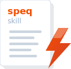

<div align="center">



# speq-skill

**A light-weight and straightforward system for spec-driven development with Claude Code**

[](specs/)
[](https://www.rust-lang.org/)
[](https://github.com/marconae/speq-skill/actions/workflows/ci.yml)
[](LICENSE)

[Getting Started](#getting-started) • [Why](#why-i-built-it) • [How It Works](#how-does-it-work) • [Documentation](./docs/) • [Installation](./docs/installation.md)
</div>

---

## Getting Started

```bash
curl -fsSL https://raw.githubusercontent.com/marconae/speq-skill/main/install.sh | bash
```

> [!NOTE]
> The installer builds `speq` from source using the Rust toolchain (installed automatically if missing). There is no binary distribution. See [Installation](./docs/installation.md) for details.

Then run `claude` and type `/speq:mission` to start.

<details>
<summary>What does the installer do?</summary>

- Downloads the latest release source from GitHub
- Installs the Rust toolchain if missing (via [rustup](https://rustup.rs/))
- Builds the `speq` CLI from source
- Installs the CLI to `~/.local/bin/speq`
- Installs plugin files to `~/.speq-skill/`
- Registers the plugin with Claude Code

To uninstall, see [Installation — Uninstall](./docs/installation.md#uninstall).

</details>

---

## Why I Built It

I want to leverage Claude Code as an effective tool to write software.

There are many other spec-driven development tools out there: OpenSpec, BMAD, SpecKit... 

...but I was missing the following:

1. A system that is not primped on one language or framework (e.g., Python or TypeScript)
2. A straightforward repeatable workflow (`plan → implement → record`)
3. A **permanent** and growing spec-library
4. A system that keeps the specs **small** to avoid context cluttering
5. A system that keeps **asking me instead of making assumptions**
6. **Semantic anchors** that ground AI behavior in established methodologies

So I built `speq-skill`. 

It combines skills with a simple CLI called `speq` that adds a semantical search layer to the permanent spec library. The search empowers the coding agent to find the right feature or scenarios during planning, but also during the implementation. This avoids reading unnecessary specs into the context window.

New to spec-driven development? Read ["Spec-driven development: an introduction"](https://deliberate.codes/blog/2026/spec-driven-development-an-introduction/) and ["Writing specs for AI coding agents"](https://deliberate.codes/blog/2026/writing-specs-for-ai-coding-agents/) on my blog.

Each skill is grounded in [semantic anchors](./docs/semantic-anchors.md) — named references to established methodologies (like London School TDD, BLUF, ADR) that steer AI behavior toward well-documented practices.

## Who should use it?

Vibe Coding does not scale. `speq-skill` adds the missing workflow and guardrails.

If you want to describe what you want and have a coding agent generate the code for you, then you should give `speq-skill` a try!

It introduces a lightweight workflow for spec-driven development. It adds a CLI to enable the coding agent to search the permanent spec library.

---

## How Does it Work?

```
/speq:mission → specs/mission.md (once per project)
                       │
      ┌────────────────┼────────────────┐
      ▼                ▼                ▼
/speq:plan  →  /speq:implement  →  /speq:record  (repeat)
```

1. **Mission** — Do it once. The coding agent explores your codebase (or interviews you for a greenfield project) and generates `specs/mission.md`.
2. **Plan** — Describe what you want. The coding agent searches existing specs, asks clarifying questions, and creates a plan with spec deltas.
3. **Implement** — The coding agent implements the plan, guided by guardrails for code quality, testing and more.
4. **Record** — The coding agent merges implemented spec deltas into the permanent spec library.

Specs live in `specs/<domain>/<feature>/spec.md`. Plans stage in `specs/_plans/<plan-name>/`. The separation keeps your spec library clean while work is in progress.

---

## Documentation

| Guide | Description |
|-------|-------------|
| [Installation](./docs/installation.md) | Setup CLI and plugin |
| [Workflow](./docs/workflow.md) | One-time mission setup, then Plan → Implement → Record cycle |
| [CLI Reference](./docs/cli-reference.md) | All CLI commands |
| [MCP Servers](./docs/mcp-servers.md) | Serena and Context7 |
| [Semantic Anchors](./docs/semantic-anchors.md) | Named methodologies grounding each skill |

---

## Important

`speq-skill` is a plugin for Claude Code and other compatible AI coding agents. This tool provides workflow structure and spec management only—**the AI / coding agent (such as Claude Code) generates all code, specs, or other artifacts**.

## Dependencies

This plugin uses [Serena](https://github.com/oraios/serena) and [Context7](https://github.com/upstash/context7) MCP servers. The installer sets them up as a convenience — they are standard open-source servers installed from their respective repositories. Their behavior, limitations, and conditions are governed by their own documentation. Context7's MCP server connects to a cloud service with a free tier — see [Context7](https://context7.com).

The `speq` CLI downloads the [snowflake-arctic-embed-xs](https://huggingface.co/Snowflake/snowflake-arctic-embed-xs) embeddings model (~23MB) on first run for semantic search.

## License

[MIT](LICENSE)

---

<div align="center">

Build with Rust 🦀 and made with ❤️ by [marconae](https://deliberate.codes).

</div>