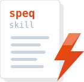

[speq-skill](../README.md) / Docs

---

# speq-skill Documentation

| Guide                               | Description                                                  |
|-------------------------------------|--------------------------------------------------------------|
| [Installation](./installation.md)   | Setup CLI and plugin                                         |
| [Workflow](./workflow.md)           | One-time mission setup, then Plan → Implement → Record cycle |
| [Headless PR Pipeline](./workflow.md#headless-pr-pipeline) | Autonomous plan/implement via a feat/ branch + PR |
| [Spec Library](./spec-library.md) | Spec format, BDD, and RFC keywords                           |
| [Decision Log](./decision-log.md)   | Design decisions, ADR fragment format, validation, and show   |
| [Model Routing](./model-routing.md) | Orchestrator skills, specialist sub-agents, and effort tiers |
| [CLI Reference](./cli-reference.md) | All CLI commands                                             |
| [MCP Servers](./mcp-servers.md)     | Pre-configured MCPs: Serena and Context7                     |
| [Semantic Anchors](./semantic-anchors.md) | Named methodologies grounding each skill |