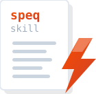

[speq-skill](../README.md) / Docs

---

# speq-skill Documentation

| Guide                                          | Description                                                        |
|------------------------------------------------|--------------------------------------------------------------------|
| [Installation](./installation.md)              | Install the CLI and the plugin                                     |
| [Workflow](./workflow.md)                      | One-time project setup, then the Plan, Implement, and Record cycle |
| [FAQ](./faq.md)                                | Add features, fix bugs, start greenfield or brownfield             |
| [Headless PR Pipeline](./headless-workflow.md) | Headless planning and implementation loops on a PR                 |
| [Spec Library](./spec-library.md)              | Spec format, BDD, and RFC keywords                                 |
| [Decision Log](./decision-log.md)              | Design decisions, ADRs, validation, and the display command        |
| [Model Routing](./model-routing.md)            | Orchestrator skills, specialist sub-agents, and effort tiers       |
| [Hooks](./hooks.md)                            | Repo-local `.speq/<name>-hook.md` customizations                   |
| [CLI Reference](./cli-reference.md)            | All CLI commands                                                   |
| [MCP Servers](./mcp-servers.md)                | Serena, Context7, both optional                                    |
| [Semantic Anchors](./semantic-anchors.md)      | Named methodologies that ground each skill                         |